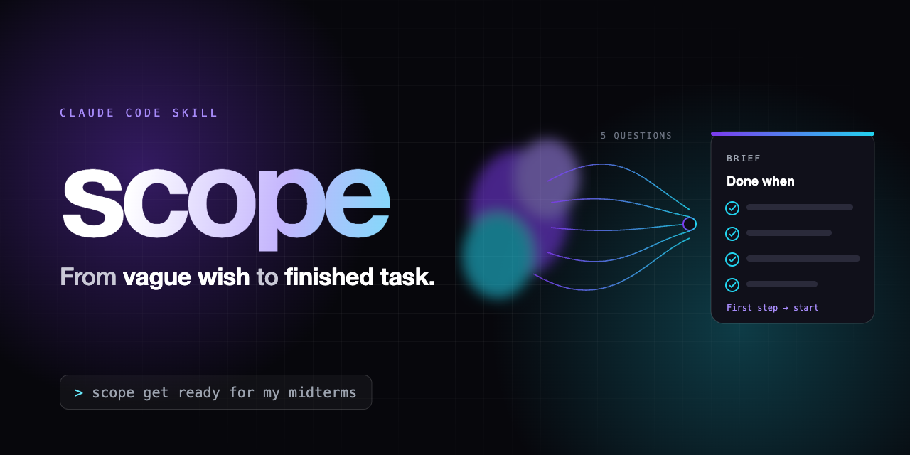

<p align="center"></p>

# scope

Turn a big, vague wish into a task you can finish. Start a message with `scope`:

```text
scope build me a website for my bakery
```

The assistant asks at most five short questions, each with a default so you can reply `ok`, then writes a one-screen brief with a definition of done. It pauses for your approval before doing any work.

Vague wishes fail because nobody decided what "done" means. `scope` decides it in about two minutes.

## What you get

```text
**Wish:** build me a website for my bakery
**Scoped as:** a one-page website for walk-in customers showing the menu, hours and location.

**For:** local walk-in customers
**Done when:**
- The page shows the menu, opening hours and a map link
- It reads correctly on a phone
- It is live on a free host with a shareable link

**Limits:** free hosting, no payments, this week
**Start from:** existing photos and PDF menu
**Out of scope (for now):** online ordering, blog, multiple languages
**Assumed:** Chinese and English are not both needed

**First step:** extract the menu text from the PDF and lay out the page sections.

Run it? (ok / change X / just the brief)
```

Reply `ok` to start the first step, describe a change to revise the brief, or say `just the brief` to take it elsewhere. See [`examples/`](examples/) for more, including a task `scope` refuses to scope.

## What is in this repo?

| File | Use it for |
| --- | --- |
| [`scope/SKILL.md`](scope/SKILL.md) | The complete skill, written for Claude Code. |
| [`PORTABLE.md`](PORTABLE.md) | A short, model-neutral version for custom or project instructions. |
| [`examples/`](examples/) | Worked runs: a vague wish, a wish that is really three projects, and a small task. |
| [`assets/`](assets/) | The banner and its HTML source. |

## Install

### Claude Code

1. Download this repository or copy [`scope/SKILL.md`](scope/SKILL.md).
2. Put it at `~/.claude/skills/scope/SKILL.md` for all your projects, or at `<your-project>/.claude/skills/scope/SKILL.md` for one project.
3. Start a new Claude Code session and try `scope plan my first month at a new job`.

See the [Claude Code skill documentation](https://code.claude.com/docs/en/skills) for skill locations and invocation.

### Codex

1. Download this repository or copy [`scope/SKILL.md`](scope/SKILL.md).
2. Put it at `~/.agents/skills/scope/SKILL.md` for personal use, or at `<your-project>/.agents/skills/scope/SKILL.md` for one repository.
3. Ask Codex to use the `scope` skill, or invoke `$scope`.

See the [Codex skill documentation](https://learn.chatgpt.com/docs/build-skills) for local skill locations.

### ChatGPT or another AI

1. Open [`PORTABLE.md`](PORTABLE.md) and copy the text inside its `text` block.
2. Paste it into your AI's custom instructions or project instructions.
3. Start a fresh conversation and type `scope` followed by your wish.

## Design rules

- One round of questions, never more than five, each with a default.
- "Done when" must be checkable by looking, never by feeling.
- The brief is shorter than the wish plus your answers. Extras go under "Out of scope".
- A wish that is really two projects gets scoped as the first one.
- Small, clear tasks are not scoped. They are just done.

## Pairs well with

[`lfg-prompt-engineer`](https://github.com/klmiing1229-a11y/lfg-prompt-engineer): `scope` decides what the task is, `lfg` turns a rough request into a prompt you approve.

## Licence

MIT. See [`LICENSE`](LICENSE).
